# Slicer NeuroCTA

NeuroCTA is a 3D Slicer extension for CTA vessel segmentation, vessel classification, and skeleton extraction. It combines both learned segmentation through nnUNet and classical vessel filtering through VMTK, plus graph-based artery classification using PyTorch Geometric.

## Supported Workflows
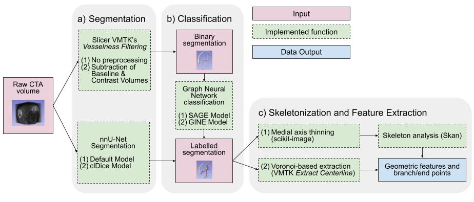

### a) Segmentation
- `Unsegmented Volume` mode for raw CTA input
- `Segmentation` mode for pre-existing segmentation input
- `Multiclass nnUNet Segmentation`
  - loads model weights from `NeuroCTA/Resources/Models/Segmentation/{cldice,default}`
  - uses `SlicerNNUNetLib` integration
- `Binary VMTK Segmentation`
  - supports optional contrast subtraction preprocessing using Slicer Elastix
  - applies vesselness filtering and thresholding to generate a segmentation

### b) Classification
- Applies graph neural network inference to segmented vascular masks
- Supports both `SAGE` and `GINE` model families
- Produces a multi-segmentation result with artery classes assigned to connected foreground regions
- Uses the supplied models in `NeuroCTA/Resources/Models/Classification/{SAGE,GINE}`

### c) Skeletonization and Feature Extraction
- `Medial Axis Thinning` backed by internal skeleton worker logic
- `VMTK Extract Centerline` using VMTK and 3D Slicer's Extract Centerline module
- Outputs skeleton models, branch point fiducials, and endpoint fiducials to the scene

## Installation

### Slicer Extension Dependencies
The following Slicer extensions must be available:
- `SlicerVMTK`, which includes `Vesselness Filtering` and `Extract Centerline` modules
- `SlicerElastix` (for volume registration)
- `NNUNet`
Install them using the Extension Manager before continuing.

### Download the Extension
- Download the GitHub repository as a Zip using the `< > Code  ` button -> `Download Zip`.
- Unzip the extension to `~/Documents/SlicerExtensions/` or elsewhere

### Load Model Weights
The nnU-Net Segmentation and Graph Neural Network Classification model weights are loacated in GitHub Releases. Download them, unzip, and place them in the `Resources/Models` directory as such:
<table>
<tr>
<td style="vertical-align: top;">
    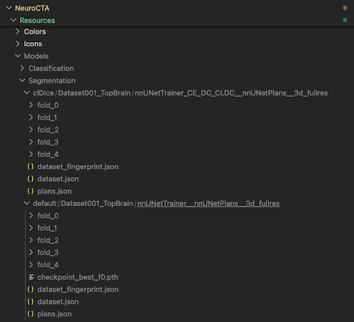
</td>
<td style="vertical-align: top; text-align: left; padding-right: 16px;">
    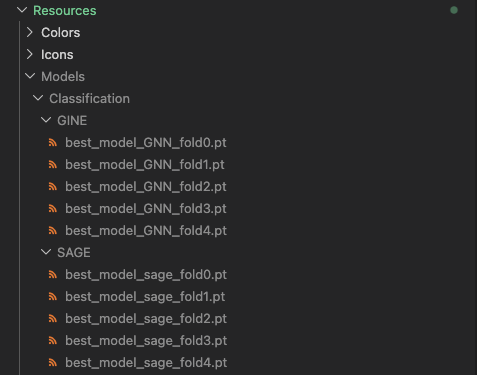
</td>
</tr>
</table>

### Load Extension to 3D Slicer
- Launch 3D Slicer. Open the `Extension Wizard` module. Click `Select Extension` and provide the path of the unzipped file.
- Click `Yes` on the pop-up dialog to add the module.

### Open the NeuroCTA module
1. If you have not installed Slicer VMTK, Slicer Elastix, and/or Slicer NNUNet, you will see the error `NeuroCTA is missing required extension(s)`. You can download them after Step 2.
2. If you are opening the NeuroCTA module for the first time, you will see the `NeuroCTA: Install dependencies` message box. Click Yes and the required Python modules will be downloaded. This will take some time. Python dependencies:

    ```
    imageio==2.37.2,
    matplotlib==3.9.4,
    openpyxl==3.1.5,
    scikit-image==0.24.0
    toolz==1.1.0
    numba==0.60.0
    skan==0.13.1 --no-deps
    networkx==3.2.1
    pandas==2.3.3
    torch==2.2.2
    torch_geometric==2.6.1
    numpy==1.26.4
    ```
## Usage

### Load Sample Data
To automatically load sample data, enter the following command in the Slicer Python console:

```slicer.util.getModuleLogic('NeuroCTA').loadResources()```

The Sample Data is also located in `NeuroCTA/Resources/SampleData`. The data can also be loaded manually with the following settings:

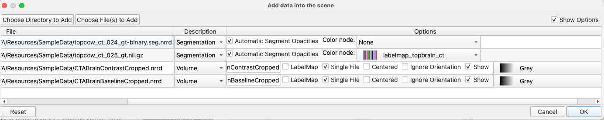


### Run Examples
#### A. Quick Full Run

Using the `CTABrainContrastCropped.nrrd` volume, run through the whole pipeline with the settings shown in the image. Note that this is just a proof of concept on a small volume. Classification results are very poor.

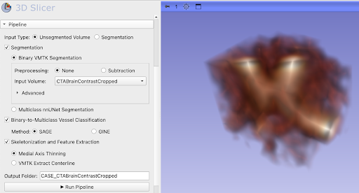


#### B. Binary VMTK Segmentation with  Subtraction as Preprocessing

Using `CTABrainContrastCropped.nrrd` and  `CTABrainBaselineCropped.nrrd`, segment using Binary VMTK Segmentation. Select the `Subtraction` preprocessing method. 

The Contrast and Baseline volumes are aligned using Slicer Elastix. They are then subtracted using the Subtract Scalar Volumes module.

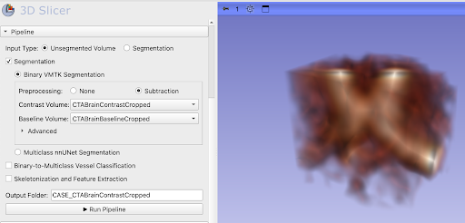

#### C. Skeletonization and Feature Extraction

Using the `topcow_ct_025_gt.nii.gz` segmentation using Binary VMTK Segmentation. Select the `Subtraction` preprocessing method. 

The Contrast and Baseline volumes are aligned using Slicer Elastix. They are then subtracted using the Subtract Scalar Volumes module.

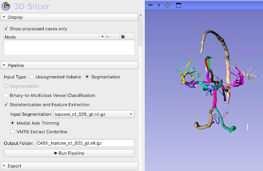

#### D. Binary-to-Multiclass Vessel Classification

Use the `topcow_ct_024_gt-binary.seg.nrrd` binary segmentation and the settings shown in the image. The segmentation output will be saved as `CASE_topcow_ct_024_gt_binary/CLAS_GINE`.

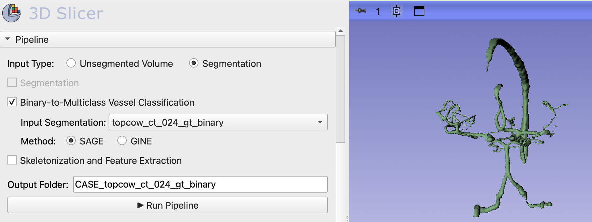

Once complete, display nodes can be shown/hidden in the display collapsible. The classified segmentation should be saved as `CLASS_SAGE` in the `CASE_topcow_ct_024_gt_binary` folder.

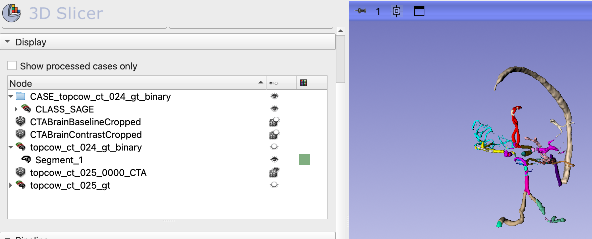

#### E. Multiclass nnUNet Segmentation 

Use the `topcow_ct_025_0000_CTA.nii.gz` volume and the settings shown in the image.

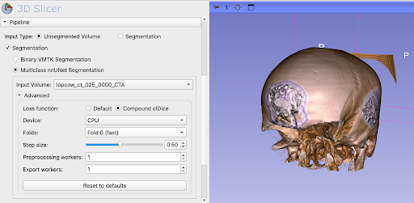

When you run it for the first time, the `nnunetv2` Python package will be installed using the Installer defined in the NNUNet Slicer extension.

On CPU, this takes approximately 30 minutes. Once complete, display nodes can be shown/hidden in the display collapsible. Segmentation should be saved to `CASE_topcow_ct_025_0000_CTA/SEG_NNUNet`.

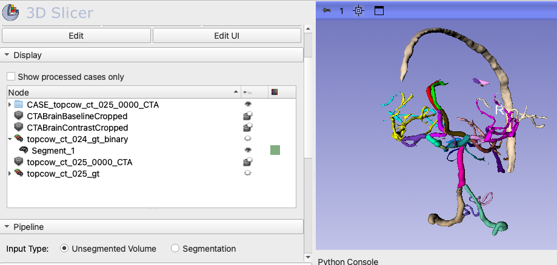

The NNUnet prediction (left side) can be compared to the ground truth segmentation (right side):
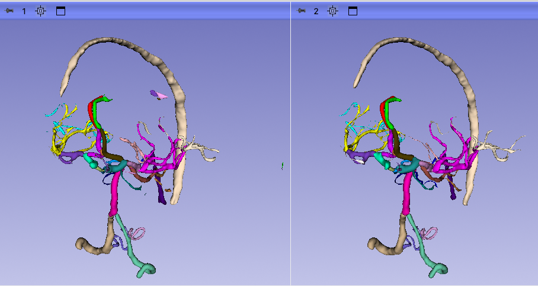


## Widget

The NeuroCTA module UI has three main sections:
- `Display`: shows the Subject Hierarchy tree filtered to NeuroCTA processed cases by default.
- `Pipeline`: lets you choose the processing sequence, configure segmentation/classification/skeletonization, and run the pipeline.
- `Export`: exports skeleton coordinates and/or feature tables for a completed case.

### Display Collapsible
Shows the Subject Hierarchy tree filtered to NeuroCTA processed cases by default. Allows user to show/hide nodes.

<table>
<tr>
<td style="vertical-align: top;">

- `Show processed cases only`: toggles whether the tree shows only nodes that have been created by NeuroCTA.
- The Subject Hierarchy tree lists volumes, segmentations, models, and fiducials created during the pipeline. Only MRML nodes marked with the attribute NeuroCTA.processed == true are shown.

</td>
<td style="vertical-align: top; text-align: left; padding-right: 16px;">
  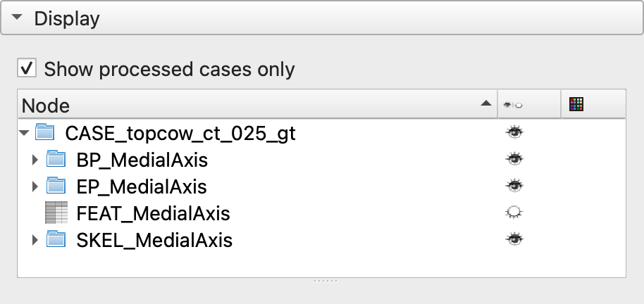
</td>
</tr>
</table>

### Pipeline Collapsible
The module generates a named Subject Hierarchy folder for each pipeline run. It auto-populates from the first selected input node, but you can edit it before running. `▶ Run Pipeline` starts the selected steps sequentially. Completed outputs are grouped under the selected `Output Folder`.

<table>
<tr>
<td style="vertical-align: top;">

#### Input Type
- `Unsegmented Volume`: start from a CTA volume node and optionally generate segmentation and downstream results.
- `Segmentation`: start from an existing `vtkMRMLSegmentationNode` in the scene.

#### Segmentation
- When enabled, the module runs one segmentation step.
- If `Input Type` is `Segmentation`, the checkbox is disabled and the module assumes the provided segmentation is the input.
- Methods: `Multiclass nnUNet Segmentation` (uses pretrained model weights). `Binary VMTK Segmentation` (VMTK vesselness filtering and thresholding with preprocessing methods `None` and `Subtraction`)

#### Binary-to-Multiclass Vessel Classification
   - Enabled when the module has a segmentation result available or when `Input Type` is `Segmentation`.
   - Methods: `SAGE` or `GINE`.
   - If segmentation is already produced in the pipeline, the classification step takes that result automatically. If starting from an existing segmentation, select the segmentation node manually.

#### Skeletonization and Feature Extraction
   - Enabled when there is segmentation input available.
   - Methods: `Medial Axis Thinning` or `VMTK Extract Centerline`.
   - If previous steps are selected, skeletonization consumes the latest segmentation result from the pipeline. If starting from an existing segmentation, select the segmentation node manually.


</td>
<td style="vertical-align: top; text-align: left; padding-right: 16px;">
  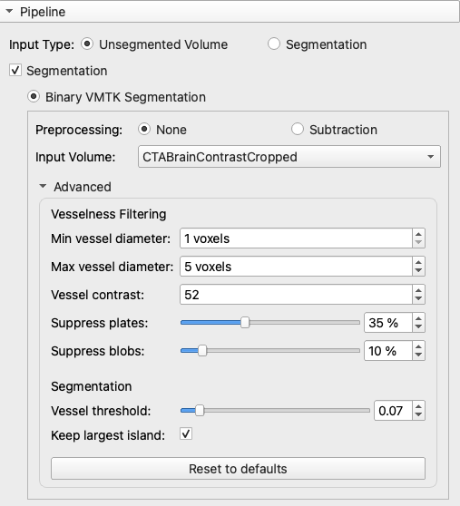
  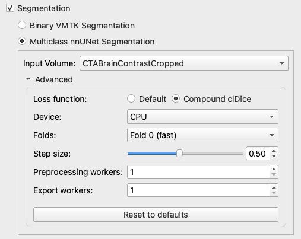
  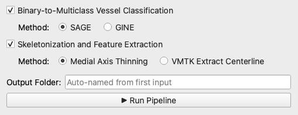
</td>
</tr>
</table>

### Export Collapsible

<table>
<tr>
<td style="vertical-align: top;">

- `Export Directory`: choose a local folder where CSVs will be written.
- `Export Case`: select a completed NeuroCTA case from the scene.
- `Skeleton Coordinates`: exports `*_coordinates.csv` containing point coordinates for skeleton curves / fiducials.
- `Segment Features`: exports `*_features.csv` containing vessel metrics saved by the pipeline.

</td>
<td style="vertical-align: top; text-align: left; padding-right: 16px;">
  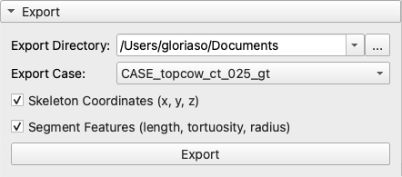
</td>
</tr>
</table>

## References
nnUNet clDice loss code are from https://github.com/lankabelgezogen/nnunet-angio-infer

```
@inproceedings{wolkhart2026intraoperative,
    title={Intraoperative quantification of hypervascularity during genicular artery embolization},
    author={W{\"o}lkhart, Thomas and Frisken, Sarah and Epelboym, Yan and Haouchine, Nazim},
    booktitle={Medical Imaging 2026: Image Processing},
    volume={13925},
    pages={569--575},
    year={2026},
    organization={SPIE}
}
```

nnUNet segmentation and Graph Neural Netowork classification models were trained on the [TopBrain dataset](https://topbrain2025.grand-challenge.org/topbrain2025/).
```
@misc{yang2025benchmarkingcowtopcowchallenge,
      title={Benchmarking the CoW with the TopCoW Challenge: Topology-Aware Anatomical Segmentation of the Circle of Willis for CTA and MRA},
      author={Kaiyuan Yang and Fabio Musio and Yihui Ma and Norman Juchler and Johannes C. Paetzold and Rami Al-Maskari and Luciano Höher and Hongwei Bran Li and Ibrahim Ethem Hamamci and Anjany Sekuboyina and Suprosanna Shit and Houjing Huang and Chinmay Prabhakar and Ezequiel de la Rosa and Bastian Wittmann and Diana Waldmannstetter and Florian Kofler and Fernando Navarro and Martin Menten and Ivan Ezhov and Daniel Rueckert and Iris N. Vos and Ynte M. Ruigrok and Birgitta K. Velthuis and Hugo J. Kuijf and Pengcheng Shi and Wei Liu and Ting Ma and Maximilian R. Rokuss and Yannick Kirchhoff and Fabian Isensee and Klaus Maier-Hein and Chengcheng Zhu and Huilin Zhao and Philippe Bijlenga and Julien Hämmerli and Catherine Wurster and Laura Westphal and Jeroen Bisschop and Elisa Colombo and Hakim Baazaoui and Hannah-Lea Handelsmann and Andrew Makmur and James Hallinan and Amrish Soundararajan and Bene Wiestler and Jan S. Kirschke and Roland Wiest and Emmanuel Montagnon and Laurent Letourneau-Guillon and Kwanseok Oh and Dahye Lee and Adam Hilbert and Orhun Utku Aydin and Dimitrios Rallios and Jana Rieger and Satoru Tanioka and Alexander Koch and Dietmar Frey and Abdul Qayyum and Moona Mazher and Steven Niederer and Nico Disch and Julius Holzschuh and Dominic LaBella and Francesco Galati and Daniele Falcetta and Maria A. Zuluaga and Chaolong Lin and Haoran Zhao and Zehan Zhang and Minghui Zhang and Xin You and Hanxiao Zhang and Guang-Zhong Yang and Yun Gu and Sinyoung Ra and Jongyun Hwang and Hyunjin Park and Junqiang Chen and Marek Wodzinski and Henning Müller and Nesrin Mansouri and Florent Autrusseau and Cansu Yalçin and Rachika E. Hamadache and Clara Lisazo and Joaquim Salvi and Adrià Casamitjana and Xavier Lladó and Uma Maria Lal-Trehan Estrada and Valeriia Abramova and Luca Giancardo and Arnau Oliver and Paula Casademunt and Adrian Galdran and Matteo Delucchi and Jialu Liu and Haibin Huang and Yue Cui and Zehang Lin and Yusheng Liu and Shunzhi Zhu and Tatsat R. Patel and Adnan H. Siddiqui and Vincent M. Tutino and Maysam Orouskhani and Huayu Wang and Mahmud Mossa-Basha and Yuki Sato and Sven Hirsch and Susanne Wegener and Bjoern Menze},
      year={2025},
      eprint={2312.17670},
      archivePrefix={arXiv},
      primaryClass={cs.CV},
      url={https://arxiv.org/abs/2312.17670},
}

```